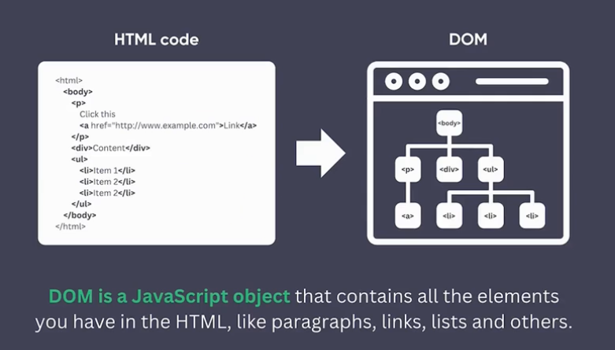
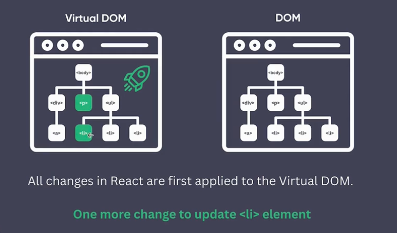
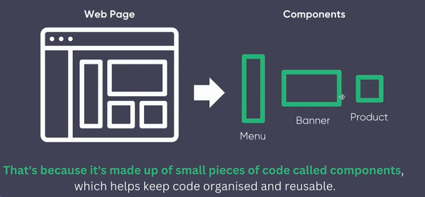
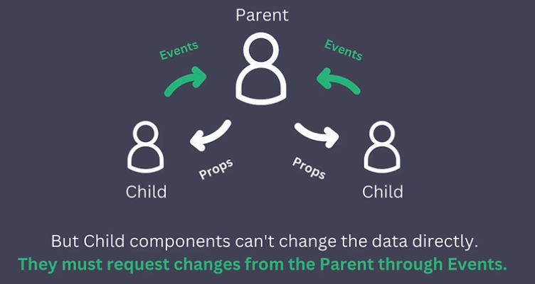

# React Crash Course: From Zero to Hero

## Section 2: Basic: Getting Started

### General notes

- [Udemy Course URL](https://fiserv.udemy.com/course/react-crash-course-from-zero-to-hero/learn/lecture/44473502#overview)
- [Github Course repo](https://github.com/dvasyliev/react-crash-course/tree/f11a88e8f9e8b90a688b7f6ebb095a7c71a7402f)
- [Create React App Dev](https://create-react-app.dev/docs/getting-started/)
- [Icons and stickers](https://www.flaticon.com)

### What is React
- DOM: 
- Virtual DOM: Virtual DOM is the lightweight copy of the real DOM 
- Components: 
- One way data flow: 

### Develop Tools
- Chrome extention plugging: [React Developer Tools](https://react.dev/learn/react-developer-tools)

## Section 3: Basic: Creating Component
- create project `npx create-react-app react-crash-course`
- to start in dev: `npm start`
- to build for production version `npm start build`
