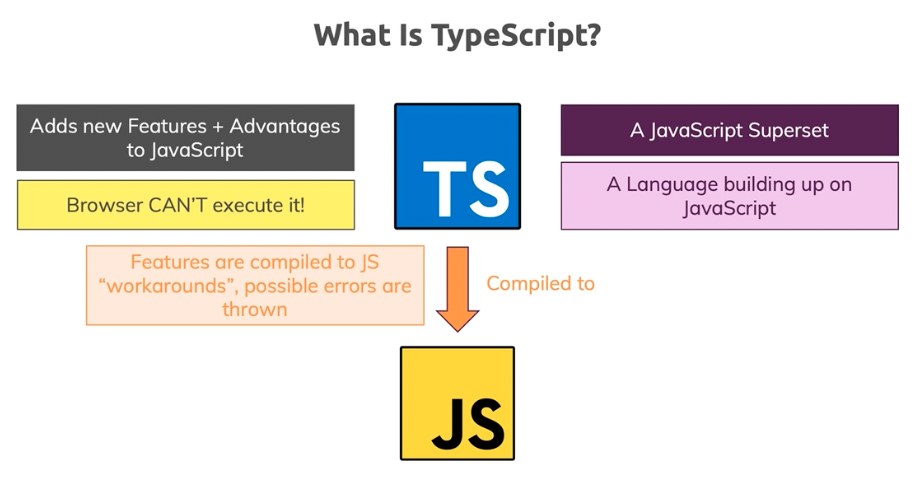
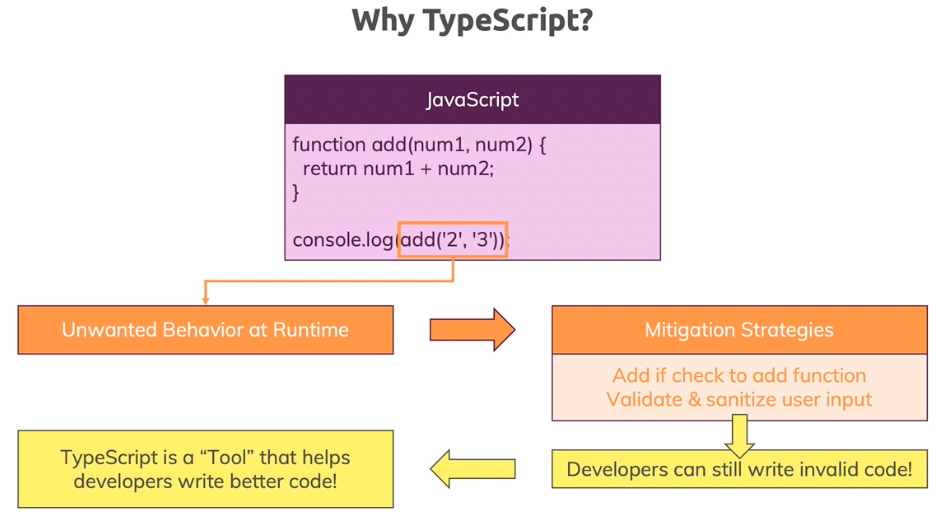
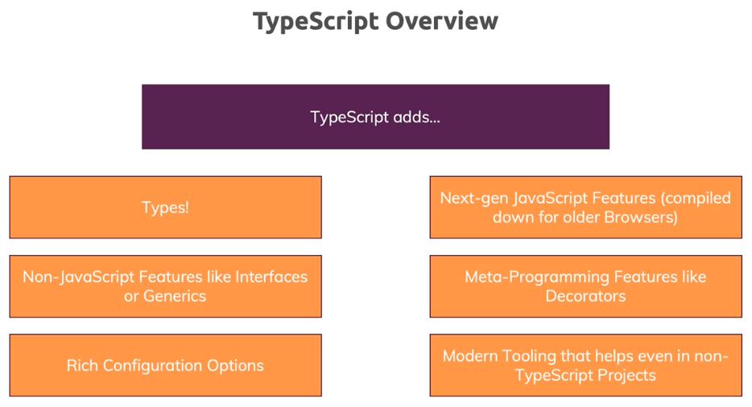
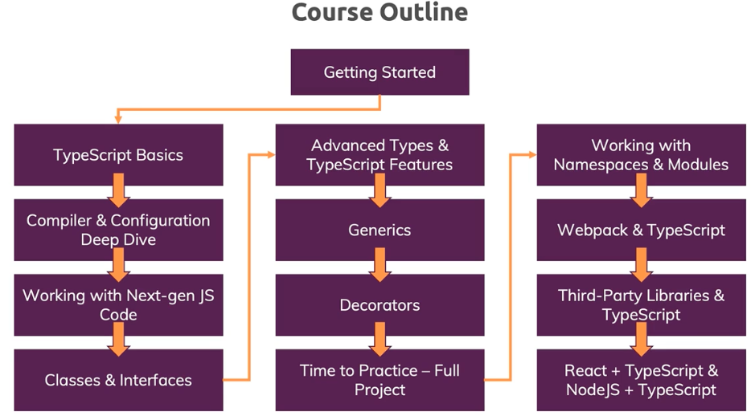

## Section 1: Getting Started
### About TypeScript
- TypeScript is Javascript Superset
- TypeScript is programing language building up on JavaScript. Its no new language, but takes JavaScript and adds new features to JavaScript, making writing JS easier.
- Browsers and node JS cannot execute TS
- TS is tool, powerful compiler which we run over our code to compile TS to JS code
- TS will be nicer eaiser to write, which will be converted into complex JS.
- TS add types, extra error checking, during development.





```js
function add(num1, num2) {
    return num1 + num2;
}

console.log(add('2', '3'));
```



- By default when we access value of input it will always be string
```js
// first-project/js-only.js
// example: access value of input is string
// TypeScript can be helpful
```
### Installing and Using TypeScript

- Go to https://www.typescriptlang.org/download/
- via npm - TypeScript is available as a package on the npm registry available as "typescript".
    - npm install typescript --save-dev
    - to invoke: tsc command
- via VSCode - 
- TS forces us to write better, cleaner and less lines of code

```js
// adjusted-project/using-js.js
// NPM: is a package management that is used to install, uninstall, and update Javascript packages on your workstation
// NPX: is a package executer that is used to directly execute Javascript packages without installing them.
// tsc using-tc.ts
npx tsc using-ts.ts
```

### TypeScript Advantages - Overview



### Course Outline



### Setting Up A Code Editor / IDE
- Extentions
    - ESLint
    - Material Icon Theme
    - Path Intellisense
    - Prettier - Code formatter

### The Course Project Setup
- Prerequisites
    - node.js is installed, we need NPM and NPX
    - lite-server: Simple development server which always serves index.html file on localhost 3000 by default
- node_modules is large file, which will be excluded in gitignore
    - run 'npm install' to load all npm packages when you clone this project

```js
// create practice_code/index.html
// create practice_code/app.ts
npx tsc app.ts

// by default any changes made to .ts file need to be recompiled to get new .js file
// instead we can install tool to do this and for that we need to initialize

// this will create package.json
npm init
// Dependencies which helps only during development
// Similar to poetry file, adding dev dependencies
npm install --save-dev lite-server
// Update package.json, scripts section

//  "scripts": {
//    "test": "echo \"Error: no test specified\" && exit 1",
//    "start": "lite-server"
//  },

// to start - run
npm start
```

## Section 2: TypeScript Basics & Basic Types

- TS addes many more types and also let us write our own type
    - Add extra sanity check
    - It does not change runtime code
- TS's type system only helps you during development (i.e before the code gets compiled)
- JS uses "dynamic types" (resolved at runtime), TS uses "static types" (set during development)


### Core Types
|Type|Example|Comments|
|---|-----|----|
|number|1, 5.3, -10|All numbers, no differentiation between integers or floats|
|string|'hi', "hi", `hi`|back tick is supported in modren JS and also used in templalte leterals|
|boolean|true, false| no "truthy" or "falsy" values|
|object|{age:30}|Any JS object, more specific object types|
|array|[1,2,3]|Any JS array, type can be flexible or strict (regarding the element types)|
|Tuple|[1,2]|fixed length array|
|Enum|enum{NEW, OLD}|Automatically enumerated global constant identifiers|
|Any|*|Any kind of value, no specific type assignment|

### Type Assignment & Type Inference
- Compilied JS does not have type
- swtich type const for var
- Type Inference (conclusion reached on the basis of evidence)
    - when type is not assigned explicitly
```js
// example for Type inference
const age1: number;
// example: code does not rely on Type inference
const age: number = 29;
// explicit set value defines the type, so no Type inference is used
```

### Object Types
```js
// basics-05-object-types/app.ts
```

### Array Types
```js
// basics-06-arrys/app.ts
```

### Working with Tuples
- Tuple is special constract which TS understands, in JS it will be normal array
- Special array with 2 elements. If we add more element using push, TS cannot catch the error
```js
// basics-07-tuples/app.ts
```

### Working with Enums
- Enum is used when we want mapped value behind the scene
```js
// basics-08-enums/app.ts
```

### Union Types
- Accept different types is when we use Union type
```js
// basics-09-union-types/app.ts
```

### Literal Types
- Exact value we want to store, in conjunction with Union type
```js
// basics-10-literal-types/app.ts
```

### Type Aliases / Custom Types
- Cutom type

### Functions as Types
- Describe a function regarding parameters and return value of function
- Created using arrow function
```js
// combineValues accept any function
// which takes no paramebers and returns number
let combineValues: () => number;

// combineValues accept any function
// which takes two paramebers, numbers and returns number
let combineValues: (a: number, b: number) => number;
```

### Function Types & Callbacks
```js
// basics-12-function-types/app.ts
```
- Official TypeScript Docs: https://www.typescriptlang.org/docs/handbook/2/everyday-types.html

## The TypeScript Compiler (and its Configuration)

### Using "Watch Mode"
- Instead of running "tsc" (TypeScript Compiler) command, we can run watch mode
- npx tsc app.ts -watch
- from project folder: npx tsc --init
    - it will create tsconfig.json file
